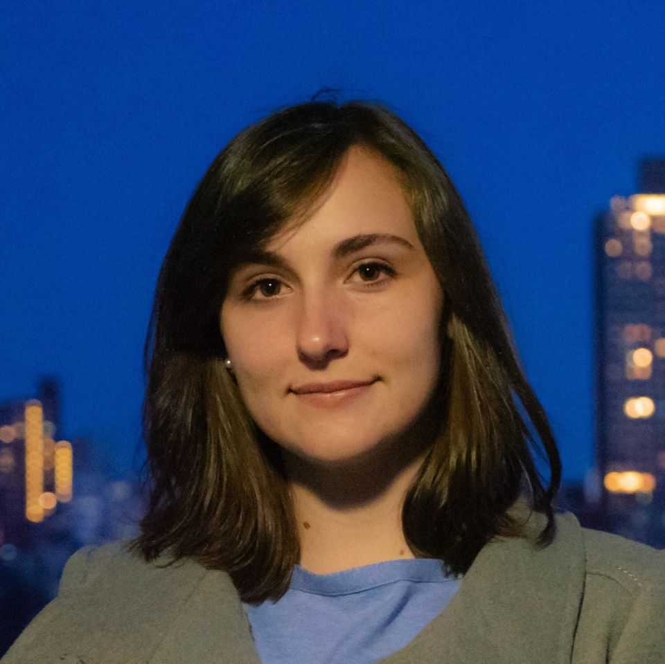

::: {.columns}

::: {.column width="40%"}
\
{style="width:100%; height:auto;"}

# Georgia E. Smits {style="text-align: center;"}
:::

::: {.column width="10%"}
\
:::

::: {.column width="50%"}
## About Me

I am currently a postdoctoral researcher researching anomaly detection under Tyler H. McCormick in the Department of Statistics at the University of Washington.

I received my PhD in Statistics from Cornell University in December of 2025. I was advised by Professor [David S. Matteson](https://stat.cornell.edu/people/faculty/david-s-matteson) with additional mentorship from my committee members Professor [Sumanta Basu](https://stat.cornell.edu/people/faculty/sumanta-basu) and Professor [Martin T. Wells](https://stat.cornell.edu/people/faculty/martin-wells). My work focused on developing Bayesian and machine learning methods for complex, noisy time series data.

## Research Interests
**Time Series:** Changepoint detection, Bayesian trend filtering, Stochastic processes, Time series classification, Rashomon sets

**Machine Learning:** Algorithmic bias reduction, Synthetic data generation, Model compression techniques

## Education
**PhD** in Statistics, Cornell University

**MS** in Statistics, Cornell University

**BS** in Physics (Intensive), Yale University
:::

:::

\
\
\
\
\
\

::: {style="text-align: center;"}
*If you like this website, credits go to [Andreas Handel](https://www.andreashandel.com/posts/2021-01-11-simple-github-website/) for the wonderful template!*
:::
